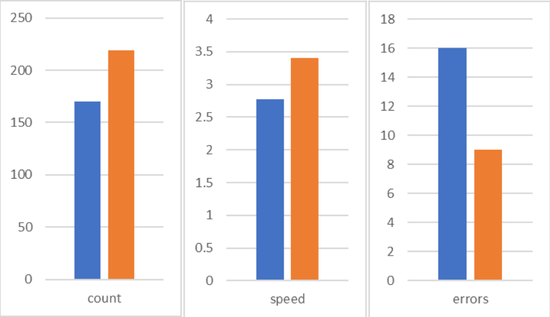

## The Effects of Body Temperature on Typing

2010383 Hikaru Suzuki

Members: Kohki Shimomura, Shun Shito

---

## Introduction

* A lot of time to use Computer 
→ Ability of Typing keyboards

<small>Thomas Witterseh, David P. Wyon, and Geo Clausen(2004)</small> 
**NO effect**: typing Speed and Error  22℃ to 30℃ Room

<small>Seppanen Olli, William J. Fisk, and Q. H. Lei (2006)</small> 
**Effect**: MAX Office work performance 21-22℃ Room

--

## Purpose
**Gap**: Body temperature and Work(Type) performance

**Goal**: To See body temperature's effect 
by Putting HOT/COLD source on human's skin directly.

---

### Methods

3 experiments: Heating hands and whole body, Cooling hands

Test: Sushida(寿司打)
<small>**Example** Total score +1180yen, correct keys 223, 3.7 key/sec, error keys 31.</small>

--

### Method 1, 2 (heat)
* Test at Usual body temperature
* Warm hands with heat pack / body with bath
  → Test at Higher body temperatures

### Methods 3 (cold)
* Test at Usual body temperature
* Cool hands with iced water 
→ Test at Lower body temperature

---

## Results

**Heating** Improved scores 
Hand: improved all score 
 

--

Whole body: improved counts and speed, Error increased

**Cooling** decayed scores Error decreased

--

### Results (Cold)

|       | Score | Corrects | key/sec | Error |
|:-----:|:-----:|:--------:|:-------:|:-----:|
| Usual(31.6℃) | -1140 |    116   |   1.9   |   33  |
|  Cold(14.3℃) | -1300 |    100   |   1.6   |   21  |

---

## Discussion

These results shows...
* **Almost certainly** body temperature affect
* Less than report by Olli, Fisk, and Lei(2006) 
10.8% / 17.3℃ **<** 8.9% / 8℃

--

It can be thought...
* Too short Heating/Cooling time
* Non-linear effect

Further research needs...
* Longer time to heat/cool
* **Temperature Adjustable** heat source

---

## References

* <small>Seppänen, O., Fisk, W. J., & Lei, Q. (2006). Effect of Temperature on Task Performance in Office Environment.</small>

<small>https://escholarship.org/content/qt45g4n3rv/qt45g4n3rv.pdf</small>

* <small>Witterseh, Thomas, David P. Wyon, and Geo Clausen. (2004). The effects of moderate heat stress and open-plan office noise distraction on SBS symptoms and on the performance of office work. *Indoor air* 14(8), 30-40.</small>

<small>https://pubmed.ncbi.nlm.nih.gov/15663458/</small>

* <small>Hedge A, Sakr W, Agarwal A. (2005). Thermal Effects on Office Productivity. *Proceedings of the Human Factors and Ergonomics Society Annual Meeting.* 49(8), 823-827.</small>

<small>https://journals.sagepub.com/doi/abs/10.1177/154193120504900807</small>
