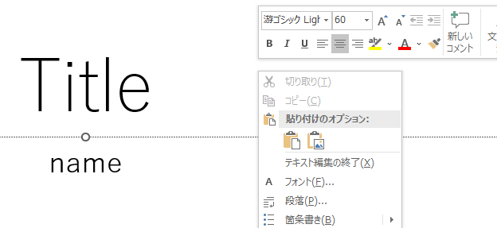
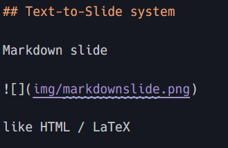
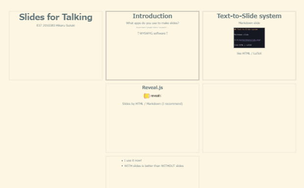
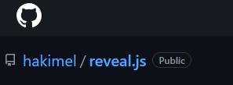

# Slides for Talking

E37 2010383 Hikaru Suzuki

---

## Introduction

What apps do you use to make slides?

<small>PowerPoint? Google Slides? Keynote? ...</small>

↑WYSWYG software↑ <small>What You See is What You Get</small>

--

### Reveal.js

Making slides by TEXT

HTML / Markdown ←I recommend

--

* I use it now by markdown!

* WITH slides is better than WITHOUT slides

---

## Text-to-Slide system

Markdown slide

like HTML / LaTeX but easier

→ Writing as Script

---

## Nesting by Chapters

→ Writing as Chapters

--

### Only Reveal.js

Other softwares 
<small>PPT and other WYSWYG, Marp and other coded apps</small> 
don't have nesting like this.

Only reveal.js 
and "powered by" it (https://slides.com/)

---

## Faster than PPT

**Less mouse moving**

**Prepared functions**
* Many Styles: easy to see (Color/Font/Size)
* Centering and Stretching

and so on...

→ Writing less than what you get

---

## Conclusion

**Reveal.js is ...**

Converting easy script into beautiful slides

What You Write **becomes** What You Get

--

Write simple texts as script

Change chapter by nesting

Prepare awesome slides in short time

with

--

OSS! Free!

---

## References

* hakimel, Reveal.js, https://revealjs.com/
* NotePM, 【2022年版】Markdownでスライド作成できるツール・サービス × 14選 (14 tools to make slides with Markdown), https://notepm.jp/blog/5994

I use reveal-md for this slide:
* webpro, reveal-md, https://github.com/webpro/reveal-md