# 超初心者向け
## GitHub Pages講習
ｺﾜｸﾅｲﾖ!

---

## 今日やること

自分のHPを作るぞ！！！

---

## おしながき

* GitHubってなに？
* GitHub Pagesってなに？
* やってみよう<br>
(ハイパー作業タイム)


---


本日の目的は「遊び方を知ってもらうこと」です。

遊ぶのに必要な部分以外は大幅にカットします。

一部**間違いレベルで雑**な説明にするときがあります。

--

録画はしないけど、この資料とGoogle先生で十分追えるはず。

ダメそうなら言ってください。

---

## GitHubとは

--

クラウドストレージ

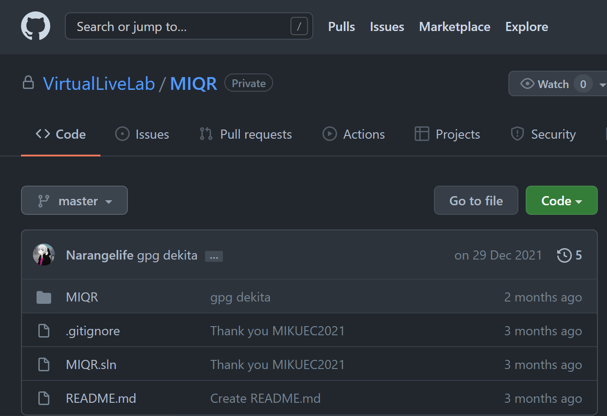

--


## Gitとは

ファイルを管理するソフトウェア

--

だいたいこういうこと

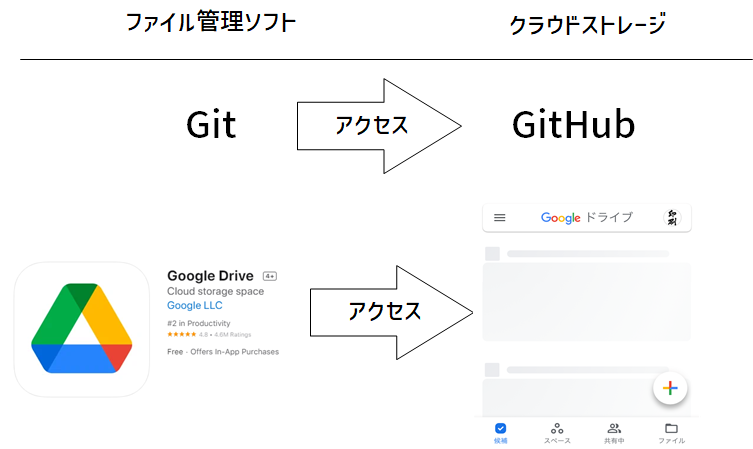

--

**これでOK**


* この世にはGitHubというクラウドストレージがある
* だいたいGoogle Driveみたいなもん

---

## GitHub Pagesとは

--

[https://netflix.**github.io**/](https://netflix.github.io/)

--

GitHubを使ってWebページを公開できるサービス

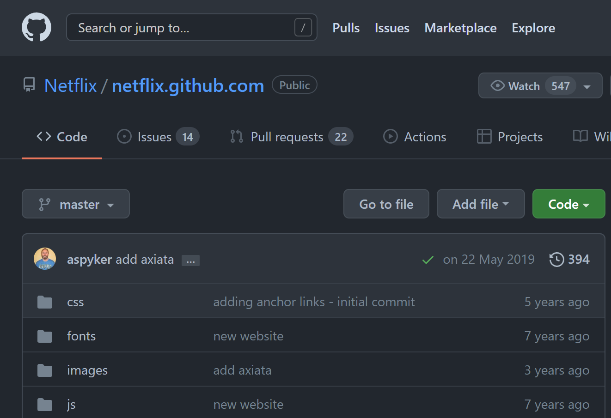

https://github.com/Netflix/netflix.github.com

--

* Webページの内容はHTMLによって書かれている
* GitHubにはファイルを置くことができる

「GitHubに置いたHTMLからWebページ公開できたら楽だな～」

↑これが**GitHub Pages**

---

## おさらい

* GitHubとは**クラウドストレージ** (Googleドライブ的なやつ) である
* アップロードしたHTMLファイルを**Webページとして公開**することができる
* 今からそれをやる

---

## 実践編


1. GitHubのユーザー登録
1. ファイルの置き場を作る
1. HTMLのアップロード
1. ページの公開

<small>有識者へ：Gitの導入は時間余ったらやる予定</small>
---

### GitHubのユーザー登録

これの通りに進める

最後は **[skip this for now]** でOK

[GitHubアカウントの作成方法 (2021年版)](https://qiita.com/ayatokura/items/9eabb7ae20752e6dc79d)


---

### ファイルの置き場を作る

リポジトリ (フォルダの上位版的なやつ)を作る<br>

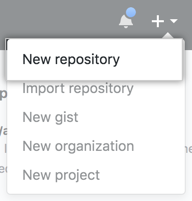

--

何でもいいので適当な名前をつける<br>
考えるのが嫌なら画像と同じでも大丈夫


--

ここにチェック


--

ここを押すと完了


---

## HTMLのアップロード

サンプルのファイルを適当な場所にダウンロード<br>
まずはこのHTMLを公開する

[サンプル](https://github.com/Suzukeh/GitHubPages_kosyu/releases/download/1/index.html)


--

アップロード

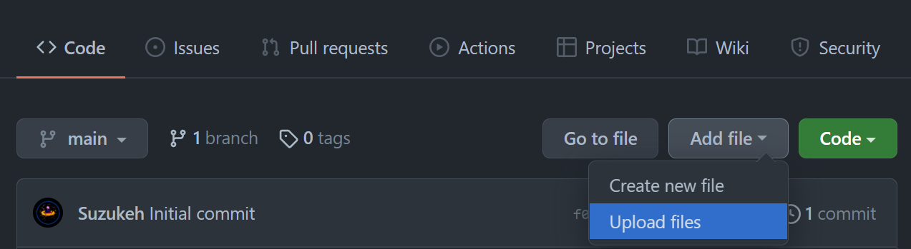

--

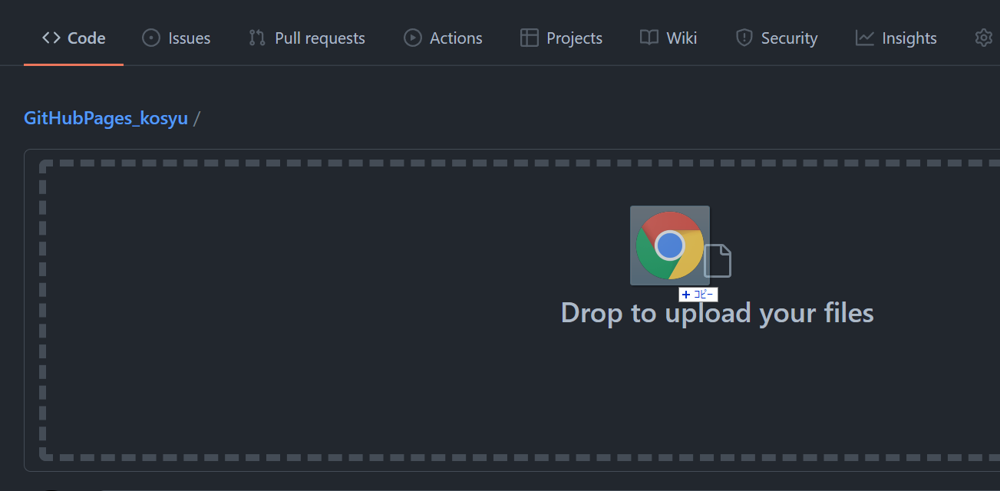

--

**Commit changes**を押したらアップロード完了

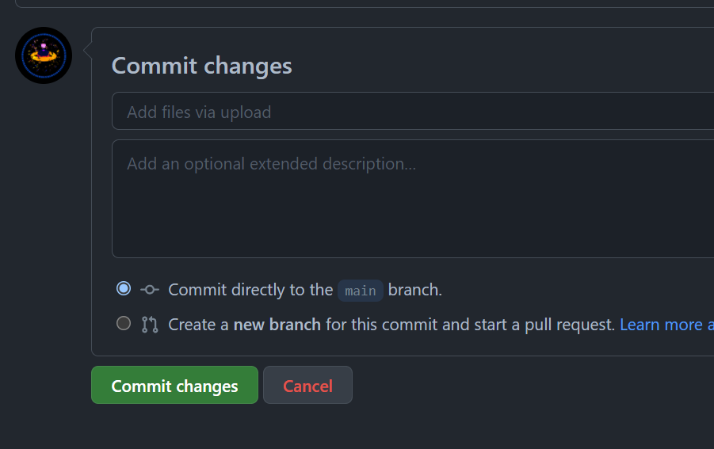

--

`index.html`があるはず

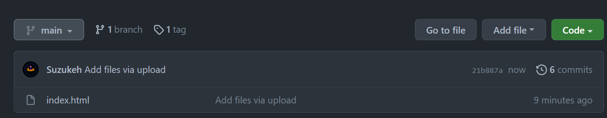

---

### ページの公開

設定を開く


--

Pagesに移動

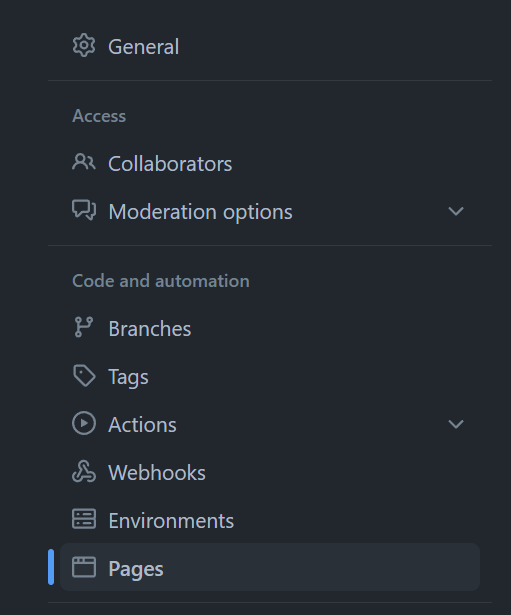

--

mainを選択して、Saveを押すと完了

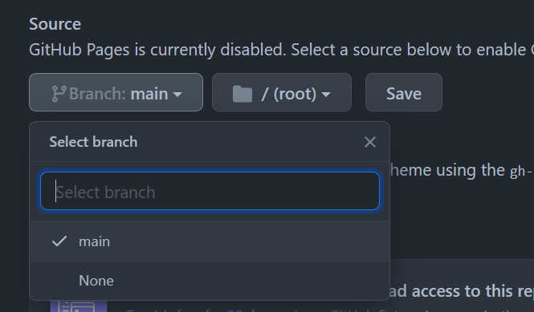

---

## できた

クリックして公開されたページを見てみよう！

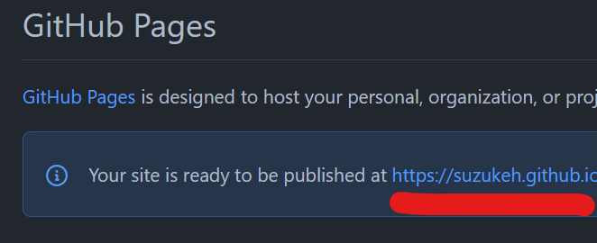

---

## まとめ

* GitHubはGoogleドライブみたいなもの
* 簡単にHPが公開できる
* すごい

気になった人は色々いじってみてね

---

**suzukeの作例**

[GitHub](https://github.com/Suzukeh)

* https://www.suzuke.dev/ ブログのような何か

* https://slide.suzuke.dev/ スライドを公開してるとこ

---

時間余ったら

### Gitのインストール

**Windows / Mac**

[GitHub Desktop](https://desktop.github.com/)

**Linux (WSL)**
```bash:
sudo apt-get install git
```

--

### GitとGitHubの接続

SSH接続をすると、アカウントを紐付けられる

みんなsolでやったはずだしできるよね

https://qiita.com/shizuma/items/2b2f873a0034839e47ce

---

### Gitコマンドの使い方 (今回の内容に使う分)

**GitHubからダウンロード** `clone`コマンド

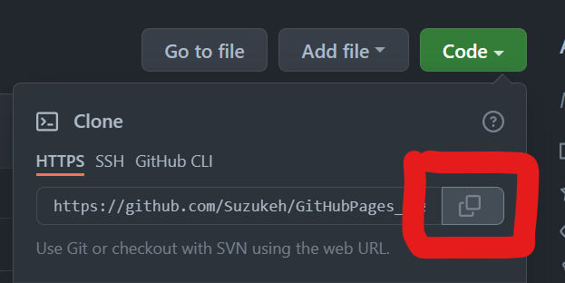

```bash:
#git clone <GitHubで作ったリポジトリのURL>.git

git clone https://github.com/Suzukeh/GitHubPages_kosyu.git
```

--

**変更を登録 その1**

`add`コマンド

```bash:
#git add <変更を登録したいもの>

git add .
```

--

**変更を登録 その2**

`commit`コマンド

```bash:
#git commit -m <変更に関するコメント 日本語も可>

git commit -m "add index.html"
```

--

**変更をGitHubにアップロード**

`push`コマンド

```bash:
git push
```

--

**GitHubと同期**

`pull`コマンド

```bash:
git pull
```