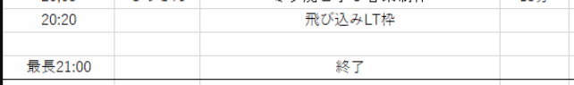
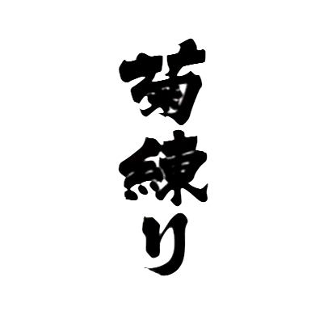
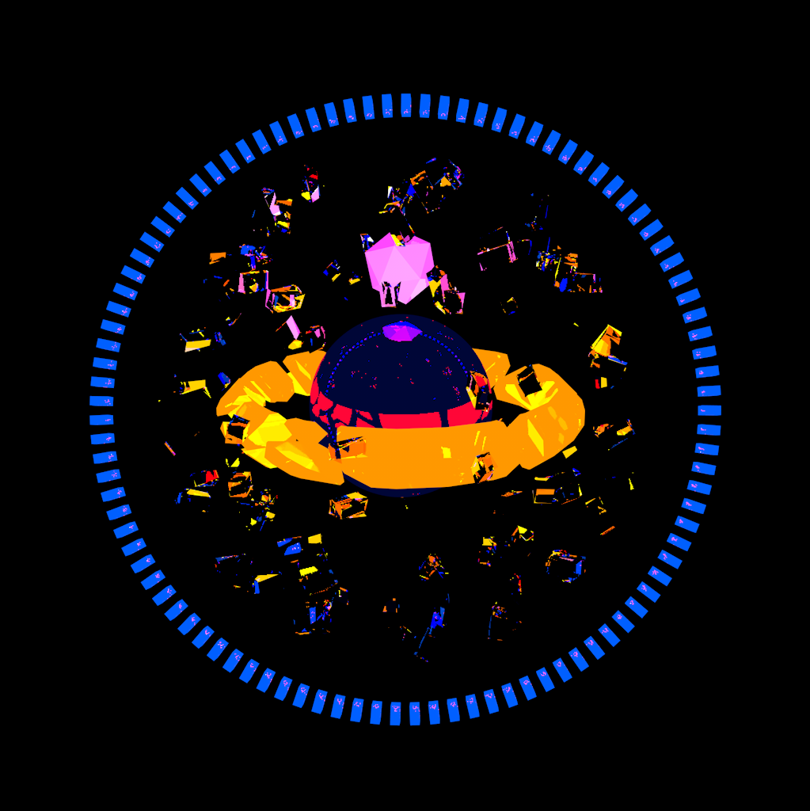

# LTをやれ！というLT
Suzuke

---

## 今日の目的

みんな軽率にLTをやるようになってほしい

--

なんなら飛び込み枠に来てくれ

---

## 自己紹介

Suzuke

鈴木

20生 Ⅲ類物理工学プログラム

VLL: セトリ・演出班長　(21年度 映像制作/LT/...)

---

## LTとは？の補足

Lightning Talk　→　ズバッとやるお話

軽い気持ちで話して、軽い気持ちで聞く

--

~~客観的に興味深い発表をする~~

自分にとって面白いと思うことを話す

--

### 例

~~VLLのアクティブな人数を保つために交流の場としてLTを推進したい~~ 
~~LTをもっと多くの人にやってもらうためにそういったことを解説する~~

LT楽しいぃぃ！！！！ 
みんなもやってくれたらもっと楽しいんだろうなあぁぁぁぁ！！！！！

---

## 結論

みんなLTで軽率にお話しようね

--

やってね

--

やれ

--

