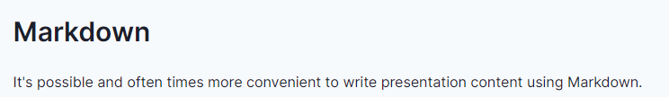

# reveal.js

## 縦横無尽のプレゼンテーション

---

## 誰

[参考：工研コンテスト](https://youtu.be/Ct2v37bGC9Q?t=7680)

---

さて

---

## 発表に向けてスライドを作るぞ！

---

マウスポチポチ、大変じゃないですか？

--

もっと簡単で、文章を書くときのようなスライド作成の環境

--

それが

# reveal.js

です

---

工研では現在LTが開催されている

↓

## 工研との関係アリ！！！！！！

---

## reveal.jsとは？

> reveal.js is an open source HTML presentation framework.

--

reveal.jsは**Markdown**でスライドを作るやつです

--

ハイパー実演タイム

---

## 一番好きなところ

--

下に

--

行けるので

--

章立てができる

---

### ハイパー公式HP周回タイム

https://revealjs.com/

https://github.com/webpro/reveal-md

---

## まとめ

Markdownですらすら書こう！

縦横無尽のアクロバティックなプレゼンをしよう！

---

これどう考えてもLT会の前にすべき話題だな…

