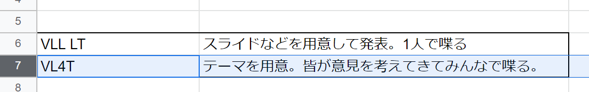

## VLL&MIKUECを存続「させる」ということについて

Suzuke(鈴木)

2022/5/15

---

## 自己紹介

20生

21年度 映像制作班長
22年度 セトリ・演出班長

去年は奇跡さえもの映像とか予約フォームとかやってました

--

## 最近の活動

[見ましたか？](https://twitter.com/uec_miku_LIVE/status/1525731455745368064?s=20&t=-twlvk1T5GOKemXxPIUrVw)

---

## 本題

**団体が存在する**というのは

* よーわからんけど続いてきた
* 今後もうまくいくように動いてきた

--

ある世代から次の世代に対して

* やりたいことやればいいよ
* これをやってるけど他のことしてもいいよ

--

団体の存続が

* 活動目的にはしていない
* 活動目的の一つにしている

---

# その前に

今回はvl4t

---

# 発表者の考え

存続させることを活動目的の一つにするべき

--

## 理由

* いろいろな分野を統合 & 1つの巨大プロジェクト 
ということの価値
* 巨大サークルの存在意義

* 自分が高校のときに失敗した　←だいたいコレ

--

## やらかしと教訓

散々好き勝手やって、引き継ぎたいって言ってくれてた人に 
「好きなことしてきたし、そうすればいいよ」 
と言ってた

→いつのまにか崩壊、間借りしてた美術部も空中分解

コレ嫌すぎ

--

### 詳細

---

みんなどう思うよ
